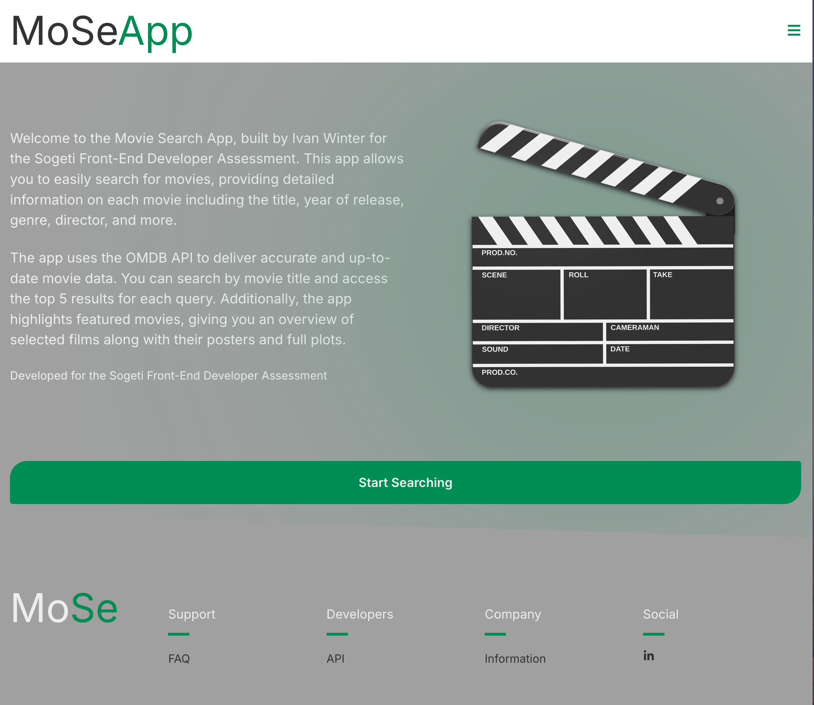

Here's a version of the README file in English, following the structure you've provided:

---

# Movie Search App

As a movie enthusiast, sometimes you want to spend time discovering new films or reminiscing about old favorites without much effort. That’s why this application was developed. As a developer, I believe it’s important to provide users with an easy way to search and learn about movies. This app allows you to explore detailed information about various movies, including their title, release year, genre, director, and much more. Additionally, the app features a “Best of Six” feature to compare popular movies based on certain criteria, and a turn-based game-like system where you can test which movie stands stronger against another.

[Link to the GitHub repository](https://github.com/mrwinter09/Sogeti)

## Screenshot



## Requirements

Users can search for movies and compare them. To get this app running on your local machine, make sure you have the following repository for the backend:

### Description

This project uses the OMDB API for fetching movie data. The backend server is required for user authentication (login and registration).

### Usage

There is no need to manually configure the API endpoints; they are already integrated into the code.

## NVM

This project includes an `.nvmrc` file to manage the Node.js version. The `.nvmrc` file specifies the recommended version of Node.js for this project. This ensures that all collaborators use the same Node.js version, helping to prevent compatibility issues.

## Running the Application

Once you've cloned the project to your local machine, first install the `node_modules` by running the following command in the terminal:

```bash
npm install
```

When that’s complete, you can start the application using:

```bash
npm run dev
```

Please note that this project uses Next.js as its development framework, so keep that in mind when running the development server.
